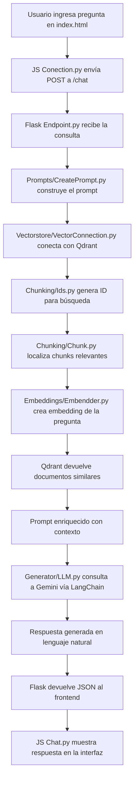

# 🤖 RAG Chatbot con Flask + LangChain + Gemini + Qdrant

Este proyecto implementa un sistema de recuperación aumentada con generación (RAG) usando Flask como backend, modelos de lenguaje de Google (Gemini) a través de LangChain, y almacenamiento vectorial con Qdrant.

Está organizado en una arquitectura modular orientada a servicios, ideal para escalar y mantener.

---
## 🔧 Arquitectura

### Componentes principales

- **Chunking**: Fragmentación de documentos largos en trozos semánticos.
- **Embeddings**: Generación de vectores semánticos con Gemini (`embedding-001`).
- **Vectorstore**: Almacenamiento en Qdrant con recuperación semántica.
- **Prompts**: Estructura y formato de entrada para el modelo.
- **Generator**: Modelo LLM (Gemini) y lógica de conversación con memoria.
- **Config**: Variables de entorno, hiperparámetros y configuración global.
- **Main**: Orquestador principal del flujo RAG conversacional.

---

## 🔄 Flujo del sistema


---

## 🧰 Tecnologías principales

- **[Flask](https://flask.palletsprojects.com/)** – servidor web liviano
- **[LangChain](https://www.langchain.com/)** – framework para LLMs
- **[Google Generative AI (Gemini)](https://ai.google.dev/)** – LLM de generación de texto
- **[Qdrant](https://qdrant.tech/)** – base de datos vectorial
- **JavaScript + HTML** – frontend interactivo
- **Render.com** – despliegue automático

---

## 📁 Estructura del Proyecto
    src/
    ├── Controller/
    │ └── Endpoint.py               # Define los endpoints Flask
    │
    ├── Service/
    │ ├── Api_or_Url/
    │ │ ├── ConfigApi.py            # Configuración de URLs y claves
    │ │ ├── GetApi.py               # Obtención de la API Key
    │ │ └── GetUrl.py               # Obtención de la URL de Qdrant
    │ │
    │ ├── Chunking/
    │ │ ├── Chunk.py                # Lógica para dividir documentos
    │ │ ├── Ids.py                  # Generación de IDs únicos
    │ │ └── LoadDocuments.py        # Carga de .pdf, .txt, .md, .csv
    │ │
    │ ├── Config/
    │ │ └── Config.py               # Variables globales: PROMPT, memoria, etc.
    │ │
    │ ├── Doc/
    │ │ └── (Archivos .pdf, .md...) Documentos fuente
    │ │
    │ ├── Embeddings/
    │ │ └── Embendder.py            # Generación de embeddings con Gemini
    │ │
    │ ├── Generator/
    │ │ └── LLM.py                  # Lógica del modelo de lenguaje
    │ │
    │ ├── Prompts/
    │ │ └── CreatePrompt.py         # Creación estructurada de prompts
    │ │
    │ ├── Vectorstore/
    │ │ ├── SetupQdran.py           # Inicializa colección Qdrant
    │ │ └── VectorConnection.py     # Conexión al cliente Qdrant
    │ │
    │ ├── .env                      # Variables de entorno locales (API keys)
    │ └── RAG.py                    # Ejecuta el pipeline completo de RAG
    │
    ├── Web/
    │ ├── Js/
    │ │ ├── Chat.py                 # Funcionalidad del Chat en Front-end
    │ │ └── Conection.py            # Conexión entre frontend y backend
    │ │
    │ ├── CSS/                      # Estilos personalizados
    │ └── index.html                # Interfaz de usuario
    │
    ├── Main.py                     # Levanta el servidor Flask
    ├── LICENSE
    ├── requirements.txt            # Dependencias del proyecto
    ├── requirements.in             # Fuente para pip-compile (opcional)
    └── README.md                   # Este archivo


---

## 🧱 Clonar el repositorio

```bash
git clone https://github.com/maxsihuar/Chatbot.git
cd Chatbot
yaml
Copiar
Editar

```
 ---

## 🗂️ Tipos de archivo soportados

Los siguientes tipos de archivo se procesan automáticamente desde la carpeta `/Doc`.  
Cada documento es fragmentado y embebido para permitir una búsqueda semántica eficiente.

### Tipos permitidos:

- `.pdf`
- `.txt`
- `.md`
- `.csv`

### 📍 Ubicación:

- Todos los archivos deben colocarse dentro de la carpeta: `/Doc`

---

## 🌐 Despliegue en Render

### 🔧 Configuración básica en Render

| Opción               | Valor                              |
| -------------------- | ---------------------------------- |
| Runtime              | Python 3.10+                       |
| Build Command        | `pip install -r requirements.txt`  |
| Start Command        | `gunicorn Main:app`                |
| Variables de entorno | GOOGLE\_API\_KEY, QDRANT\_API\_KEY |

Render te dará una URL pública como:

```
https://chatbot-api.onrender.com
```

---

# 🌍 Conexión del Frontend con Render

> El límite es el de 64 bits... porque soñar en grande merece arquitectura de verdad 😎.

Este chatbot ya se encuentra en **deployment**, es decir, está corriendo en la nube como todo proyecto listo para producción.

🔗 **Míralo en acción aquí**:  
👉 [https://chatbot-lg97.onrender.com/](https://chatbot-lg97.onrender.com/)


---

## 📎 Licencia

Este proyecto está bajo la licencia MIT.

---

## ✉️ Autor

**Max Sihuar Holguino Nuñez**\
Repositorio: [Chatbot](https://github.com/maxsihuar/Chatbot)

¿Preguntas? ¡Abre un issue o contáctame por GitHub!

